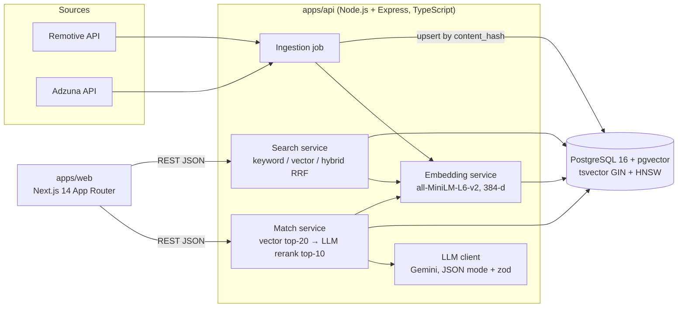

# TalentLens

Semantic job search and resume matcher over 7,141 real job postings. Keyword search, vector search, and the two
fused with Reciprocal Rank Fusion, so the three can be compared on the same query. Upload a resume and get ranked
jobs with grounded explanations of fit and missing skills.

Next.js 14 · Node.js + Express (TypeScript, strict) · PostgreSQL 16 + pgvector (HNSW) · local MiniLM embeddings ·
Gemini for reranking, with a deterministic fallback.

**Status:** the API is live at <https://talentlens-api-k0rp.onrender.com> (try
[`/api/health`](https://talentlens-api-k0rp.onrender.com/api/health) or
[`/api/search?q=senior+react+developer`](https://talentlens-api-k0rp.onrender.com/api/search?q=senior+react+developer)),
serving the full 7,141-job corpus from a managed Postgres in Tokyo. The web app is live at
<https://talentlens-silk.vercel.app>. The 50 evaluation queries are not labeled yet, so no Recall@10 number is published.
Design: [docs/ARCHITECTURE.md](docs/ARCHITECTURE.md). Progress and every measured number:
[harness/STATE.md](harness/STATE.md).

## What it does

- **Search** (`/`) — one query, three modes. Each result shows its keyword rank and its vector rank, so the
  difference between the modes is visible rather than asserted. Filters: remote, country, minimum salary.
- **Resume match** (`/match`) — drop a PDF or paste text. The resume is chunked, embedded, compared against every
  posting, and the top 20 are reranked by an LLM into 10 results with a fit score, reasons, and the skills the
  posting asks for that the resume does not show.
- **Job detail** (`/jobs/[id]`) — the full posting, salary, source credit and a link to the original advert.

## Architecture



Design decisions and their trade-offs are in [harness/DECISIONS.md](harness/DECISIONS.md): Postgres instead of a
separate vector database, HNSW instead of exact search, RRF instead of score blending, and why LLM output is
treated as untrusted input.

## Measured results

Every number here was produced by a command in this repository. Nothing is estimated.

| Metric | Value | Command |
| --- | --- | --- |
| Jobs ingested | 7,141 (Adzuna 7,125, Remotive 16) across 3,124 companies | `pnpm --filter api ingest` |
| Jobs embedded | 7,141 of 7,141 | `pnpm --filter api embed` |
| Embedding rate | 28.3 s per 1,000 jobs (CPU, fp32) | `pnpm --filter api embed` |
| Embedding cache on re-run | 7,141 skipped, 0 re-embedded | `pnpm --filter api embed` twice |
| Search latency, p50, local | keyword 1.3 ms · vector 8.7 ms · hybrid 14.4 ms | `pnpm eval` |
| Search latency, mean, local | keyword 2.4 ms · vector 10.3 ms · hybrid 20.6 ms | `pnpm eval` |
| Search latency, p50, live API | keyword 102 ms · vector 730 ms · hybrid 757 ms | 10 queries per mode against `/api/search` |
| Resume match, end to end | 7.5 s with the LLM rerank, 10 results | `POST /api/match` |

The live figures are much higher than the local ones for one reason: embedding the query runs on a free instance
with a throttled shared CPU. The keyword number, which does no embedding, is mostly the round trip from the API
in Singapore to the database in Tokyo. The local numbers are what the design is budgeted against
([ARCHITECTURE §12](docs/ARCHITECTURE.md)); the live numbers are what a free tier delivers.

Recall@10, Precision@10, nDCG@10 and MRR@10 are computed by `pnpm eval`, but **no search quality number is
published here yet, because the label set behind them has not passed validation.** The 50 queries in
`eval/queries.jsonl` can be labeled by hand (`pnpm --filter eval label`) or by an automated Gemini relevance
judge (`pnpm --filter eval judge`). The judge was checked against the owner's hand labels on 10 queries: 78.5%
raw agreement, but Cohen's kappa -0.051, which is no better than chance, because both labelers call nearly
every pooled job relevant (86.1% and 91.0%). `pnpm eval` reports that verdict itself and marks the figures as
not a result; [eval/results.md](eval/results.md) carries the full table either way, and ADR-017 records what
would have to change in the evaluation design to fix it.

## Run locally

Requirements: Node.js 20, pnpm, Docker.

```sh
sh scripts/setup.sh          # pins the commit identity, enables the guard hooks
pnpm install
docker compose up -d         # PostgreSQL 16 + pgvector
cp .env.example .env         # then fill it in
pnpm --filter db migrate
pnpm --filter api ingest     # fetches jobs; takes about 9 minutes for the full corpus
pnpm --filter api embed      # embeds everything new; about 28 s per 1,000 jobs
pnpm --filter api dev        # http://localhost:4000
pnpm --filter web dev        # http://localhost:3000
```

`GEMINI_API_KEY` and `GEMINI_MODEL` are optional: without them the resume match still works and returns results
ranked by similarity alone, marked as such in the UI, and the job ad scorer still produces its full score,
without the written suggestions. The live API has both set. The key is on a free Gemini tier with a daily
request cap, so once that is spent the deployment falls back to similarity-only matches and an unannotated
score until it resets, and a transient model outage does the same. That is the designed behaviour, not a
failure (see [ADR-008](harness/DECISIONS.md)). The model is `gemini-3.8-flash` ([ADR-019](harness/DECISIONS.md)). `ADZUNA_APP_ID` and `ADZUNA_APP_KEY` are needed for the
Adzuna half of the corpus.

Checks, the same ones CI runs:

```sh
pnpm lint && pnpm typecheck && pnpm test
```

Full command list: [AGENTS.md](AGENTS.md#commands).

## Data sources

Job data comes from two public APIs and every result links back to the original posting:

- [Remotive](https://remotive.com/) — remote jobs, via Remotive's public API.
- [Adzuna](https://www.adzuna.com/) — via the Adzuna search API.

Nothing is scraped. Salaries Adzuna marks as predicted are discarded rather than shown as if advertised.

## Author

Bittu Mandal · [@ishowguts](https://github.com/ishowguts)
